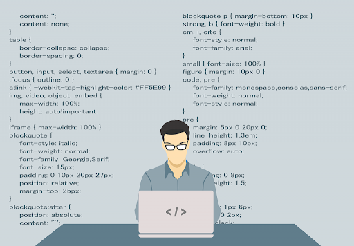

# Morality and Ethics let us be us.
We all learn morality and ethics. They are important, not because they are what we are expected to comply by but because they result in righteous and fair consequences. Even if it is impossible to find the perfect decision that will cause the ultimately positive consequence for everybody, it is possible to justify the decision with the rules that have been promised by a lot of people in the society and been understood as the best in the understanding of Utilitarianism. Beyond the concept Utilitarianism, as a human, we know that we are not allowed to abuse anything when we are not justified. In the process of socialization, we all learn morality and ethics not to harm other people but to help the society to be 'society'. They let us be us.

# Trolly Problem.
Back in my middle School in South Korea, one of the mandatory courses to graudate was 'education for Morality and Ethics.' The course was easy but boring. Most of my friends in the class did not really pay attentions to what the teacher was trying to say. However, there is a speicific problem that he told us in the middle of the lesson. It was the first time when I faced the famous 'trolly problem.' The problem is simple: it asks us, in the context of utilitarianism if we will kill the one, we strongly cherish to save a lof of innocent people on the train. When the teacher started to talk about the problem, there were a lot of different answers with different perspectives. In the moment, I personally thought that it is impossible to choose, because either of the decisions will not exonerate me from the blames. What you believed that will save a lot of people from the pains will actaully cause the terrible consequences for others, which is a disaster. However, my belief in Ethics is that the greatest good to the greatest number of people is the only measure of the right and wrong. In short, I will kill the one who I cherish in the trolly problem, even though the trolly will come back to crush myself.

# Ethics as Software Engineer.
Utilitarianism is always not applied and justified. Majority rule is powerful and accepted in a lot of contexts in the freedom of the country. However, what majority wants can harm a lot of innocent people. Moreover, the process is as important as the end. Even though your behavior will make the better consequence for a lot of people, you will not be justified, unless your process is clear and moral. For example, software engineers are responsible not only for the consequences of what they develop but for the process transparency. They must be honest and respectful for other people, including their colleagues. They need to be centered on the values of humans, even if they are often closer to computers. Here, considers the quote, "This obligation includes promoting fundamental human rights and protecting each individual's right to autonomy. An essential aim of computing professionals is to minimize negative consequences of computing, including threats to health, safety, personal security, and privacy," from 1.1 ACM Code of Ethics. As we know that ethics is complicating and can be understood in a lot of different perspectives, I believe that it is important to spend more time for anticipating the results of our behaviors.

# Understanding Bill's in His Shoes.
This is based on an [Essay](https://www.freecodecamp.org/news/the-code-im-still-ashamed-of-e4c021dff55e/#.tsjl7lkxy). written by Bill Sourour. The essay states about the codes that he was required to write down when he was working for the interactive marketing firm in Canada. The codes are for the drug firm that wanted Bill to develop the website to give random teenage girls quizzes to lead them to the drug that it wanted to sell. If I am given to argue for my verdict, I will say that he violated the code of ethics as a computing professional. I would like to quote, " Examples of harm include unjustified physical or mental injury, unjustified destruction or disclosure of information, and unjustified damage to property, reputation, and the environment," from 1.2 Avoid Harm of ACM Code of Ethics. As a software engineer, he could take a little bit more care for the ethics and the possible consequences to avoid any harm. In the essay, the author mentions that he was not 'fully' aware of the possible negative consequences of the requirements that did not bother him and just did a job as a software engineer. He did not have any intention to victimize someone with the codes that he just built as usual, which has unfortunately made him go through serious mental therapies. Sadly, he should have discussed with his team about the requirements. Until he reached to the dinner with his client, there must have been a lot of moments when he said, "that is what the client wanted for." In short, I believe that he was not doing anything illegal but sadly violated the ethics as a software engineer.

# Promises
"The greatest happiness of the greatest number is the foundation of morals and legislation," a philosopher Jeremy Bentham said. Even though, as I mentioned above, utilitarianism is not always correct, I still believe in the worth of the doctrine. To avoid the wrong judgement, I will always spend more time for analyzing the work assignments and the following consequences than I am needed. Processes and consequences are both carefully considered as much as possible. I will guarantee the process transparency and the minimized harms from whatever I develop. As we can check in ACM code of Ethics, I must be honest and trustworthy. Moreover, in the faith that I will make the decision for the majority, I will not ignore the probability that my work can be harmful to some people. As we can learn in Bill's essay, unintended behaviors can make unintended consequences. Thus, I will always make only intended decisions with purposeful and rational reasonings. 

