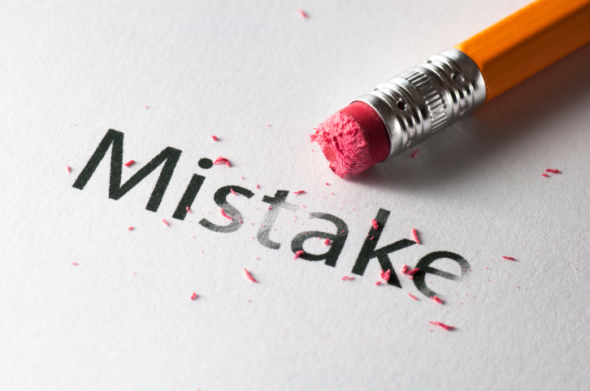

In the world, we sometimes find people, including ourselves, having troubles to improve their quality in their field. It is common for people to face slumps and be depressed enough to stop their struggling. Improvement is important and strategic, whoever you are and wherever you are. For example, if you spend a lot of time in your field and cannot see any improvement in the situation, your motivation will be deprived. In other words, a progress is like a red bull to keep you motivated and your journey last.

Mistakes are painful. Even though they are eventually beneficial, they will not be anybody’s favorite. They are considered horrible to happen when you are in an important meeting or exam. Even though it is known that a failure is a mother of a success, whoever you are, you will want to have a perfect success without hitting any rock on the road. However, they a. The perfect success is ideal but imaginary. A key to success is a failure, as they say. This formula is applied all over the world, even in Computer Science. For example, consider Machine Learning. The longer Machine goes through a lot of failures and successes in the tester, the better it develops data model. Moreover, when you write down the codes in java script, if your codes have syntax errors and are hard to understand, you can learn from those mistakes and make next codes cleaner and exacter. Indeed, mistakes lead you to improve your quality.

During the three years of my college life, I have made a lot of mistakes. One of them that I regret still now is that I used to ignore the mistakes that I made. I just avoided them, because I thought that failures are not acceptable but painful to me. However, I have changed myself to accept the importance of the failure. As an entry data analyst, I have always dreamt to be competitive in my field. Then, the most important thing is to keep progressing toward the goal. Now, I believe that I have the best teacher to lead me to the everlasting improvement: Mistakes.

