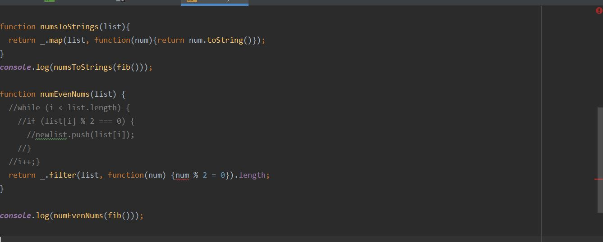

# "Pancakes that are ganrnished well are even tastier."
There is a famous Korean saying, which is; "Pancakes that are garnished well are even tastier." There are some exceptions about the saying, but it is true that code standards make your code look well-organized and easy to follow, regardless of your coding skills. They are interpreted as promises that are set up by a lot of programmers in the world; in order to keep a code readable to other people. Programming has a history, and the standards are the results of the efforts for all of the programmers to keep their codes understandable. As if the access to the books in the well-maintained library is much conveninent, the code standards will help other programmers easily access to your codes. Even though the algorithm you built is impressively faster than others, if it is too messy to follow, the impact that the code is going to bring to the world will be reduced to the point that it will be unfortunately ignored/misunderstood. Eventually, to check if your code fits in the code standards is to protect yourself from being misunderstood/ignored by other programmers. Coding skills are impressively important to programmers, but if your code does not follow the standards, it will never be appreciated by your audience. Indeed, code standards will never be underrated, when you code. 

#   This Is All For Yourself.
As we know code standards are important, the question comes up to our minds: "How can you know your code fit in the standards?" While coding in Java Script with Intellij, it will not difficult to see people using "ESLint." ESLint powerfully functions like CheckStyle in Java with Eclipse. It tells you which part of your code violates the standards. Even though the warning sign in the right top of your script will bother you at first, it will eventually lead you to the well-organized code with the warning chaning to the green checkmark. Indeed, if you, at least, follow it, you can build your code in the readable ways, without wasting your time for checking your code repeatedly. In this point, if you have a thought like "I mean if my code works well, I do not have to care about the standards," you need to think that following the standards is always for you, not for other people. If you will keep your codes only to yourself, you will not even need to correct any syntax in your code. However, it is really likely that you will need to make people understand your code and explain how your code works. Thus, even though to ensure the green checkmark in your code script is painful, you will need to do it for yourself.
    