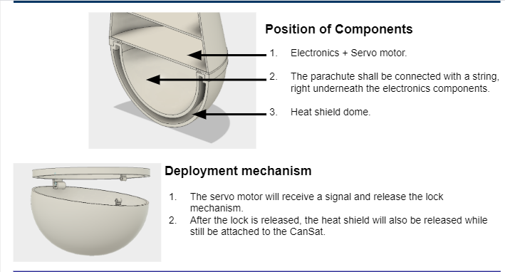
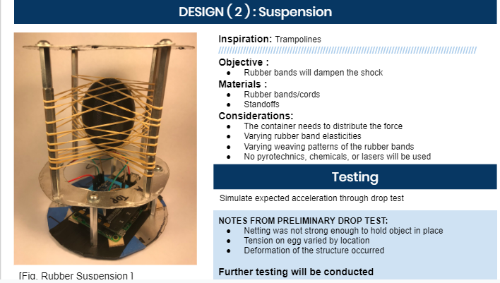

  

# Description
  CANSAT is a year-long competition held by the National Aeronautics and Space Administration. Various groups of 7 students who are interested in Science and Engineering from all over the world participated in the competition. It was required in the competition to research certain needed information, design a small rocket and develop it to successfully launch into the high altitude and protect an egg inside under the high pressure and temperature.
  

  
  

# My Role
  For my team, I worked as the researcher for mechanical parts. I communicated with teammates, who worked for the overall design of the rocket and the budget situation, and researched for affordable units, notable scientific facts, and referable technologies, according to what we discussed.
# Performance
  On the stage Preliminary Design Review (PDR), we needed to present our ideas and convince a group of judges via teleconference. During the review, it was required to explain about the systematical choices such as the devices and units and codes that we decided to utilize, the electrical choices such as the sensors that we put in the rocket for the temperature and pressure, and the mechanical reasons about release and fail-safe mechanisms.

  My team ended up concluding this competition at the rank 81th.

You can learn more at the [CANSAT Website](http://www.cansatcompetition.com/).
