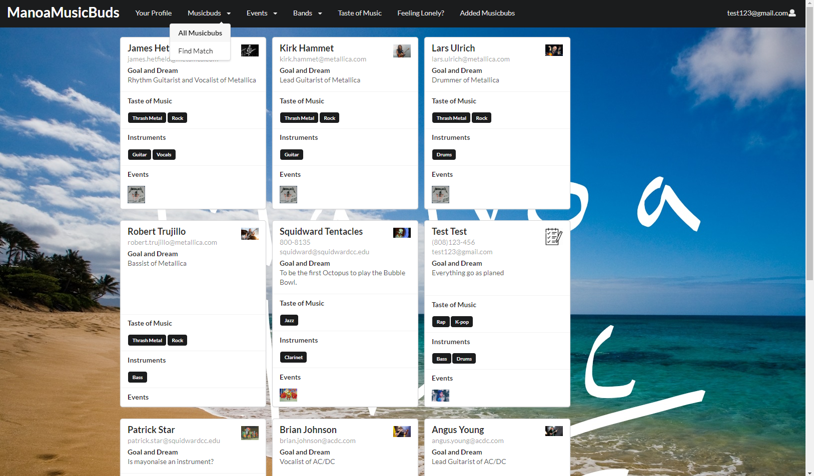
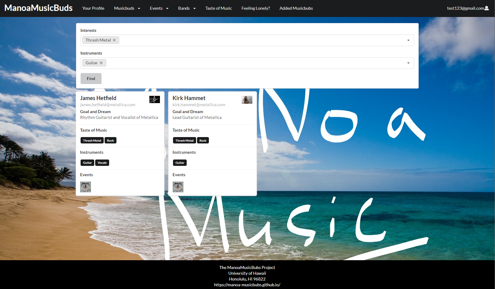

# Description
  Manoa-musicbuds is an example web application where many UH students with great musical talents find others with similar tastes and compatible musical abilities. It will allow students to login and create a profile indicating their musical tastes, their musical capabilities, and their musical goals (from occasional, informal jam sessions to performing bands). The profile can also include links to YouTube videos or SoundCloud tracks with examples of their musicianship.
  

  
  

# My Role
For my team, each of us ws assigned to different issues through milestone sections of github projects. With the faith in the team performance, I tried to ensure that each of us understands each other's responsibilites for this project. Technically, I ensured that ManoaMusicBuds website has basic struture and design to be deployed. For example, I worked for the overall design of the website. In short, I worked for the front-end sides for this website. 
  
 I set up the fundmental structure of the website. I made that users would see what this website is for and created crucial components such as navbars. Moreover, I cretaed the system where users create the accounts and the websites accept the data and show as profile cards based on the users' information. Greately, I created the function to delete profile cards when the users want to. At the end of the project, I created the admin page for administrators to manage users' data. 
 
  
  If you wonder what issues I was assigned to, you can see in [Milestone](https://github.com/manoa-musicbubs/manoa-musicbuds-source/projects)

# Achievements
  Luckily, this project was interesting to every member in our team. We all were motivated to work together as a team. First achievement I will note is that I have learned the importance of working as a team. Understanding what issues need to be resolved and assigned to, we could make our work more efficient. Second achievement is that I have learned how to deploy the web-application through galaxy and mongo db. The most important achievement through this web-development project is that we have learned that our knowledge can help some people in the strongly technical ways.

You can learn more at the [MANOAMUSICBUDS Guidelines](https://manoa-musicbubs.github.io/).
You can see our source codes at the [mANOAMUSICBUDS Source](https://github.com/manoa-musicbubs/manoa-musicbuds-source)

