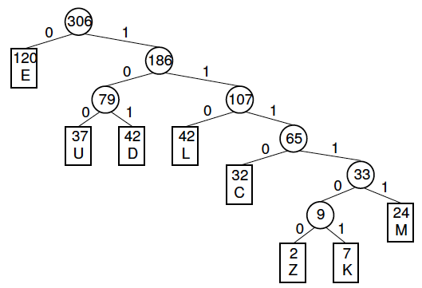

  As an assignment for ICS 211 class in University of Hawaii at Manoa, I achieved Java Program Huffman Tress to encode and decode files. It was written in Eclipse. The file is made of several different classes including act as encorder, decorder, compressor, decompressor, and J-unit tester. 
  
  Through this assignment, I improved my comprehension of node concepts and binary-reading skills in Java. To complete the assignment, it took two and three days and solved technical problems with peers in the class. Since this assignment was considered the most difficult assignment for the class, I emphasized the importance of the group work to myself.

<div class="ui small rounded images">
  

  


```js


// if args.length == 0
    if (args.length == 0) {
      // system.out.println usage message
      System.out.println("Usage: java H11Huffman <filename>");
    } else {
      // Get the filename
      String filename = args[0];
      System.out.println(filename);
      // check the last extenstion
      int index = filename.indexOf(Huffman.HUFF_EXT);
      if (index != -1) {
        // if Huffman.HUFF_EXT do decompression
        String outputName = filename.substring(0, index);
         System.out.println(outputName);
        //  create a file output stream with the name without .huff
        FileOutputStream out = new FileOutputStream(outputName) ;
        //  create a file input stream from the filename
        FileInputStream in = new FileInputStream(filename);
        //  call Huffman.decompress(fileInput, fileOutput)
        Huffman.decompress(in, out);
        out.flush();
        out.close();
        
```

You can learn more at the [ICS211 Webstie](http://courses.ics.hawaii.edu/ics211f19-1/morea/120.trees/experience-H11.html).

